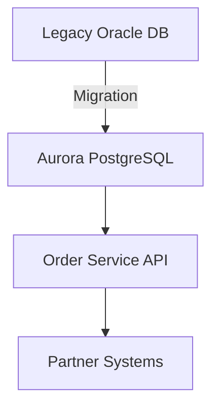

# ADR-001: Oracle → PostgreSQL Migration

**Status:** Proposed  
**Date:** 2025-09-18  

## Context
- Availability: 99.9%
- Latency: P95 ≤ 250 ms
- RTO/RPO: 2h / 15 min
- Cost cap: $9k/month
- Data residency: must stay in India region

- Legacy: Monolith on Oracle DB, SOAP APIs
- Pain: high licensing cost, weekend downtime, poor scaling
- Team: 6 Java devs, 3 SREs, no Kafka expertise
- Constraints: prefer managed services, limited change window

## Options
1. **Amazon Aurora PostgreSQL (managed)**
   - ✅ Pros: Managed service, auto-scaling, built-in HA
   - ❌ Cons: Vendor lock-in, cost
   - ⚠️ Risks: Migration complexity, skill gap

2. **Self-managed PostgreSQL on VMs**
   - ✅ Pros: Full control, cheaper infra
   - ❌ Cons: Ops overhead, patching
   - ⚠️ Risks: Reliability, SRE burden

3. **PostgreSQL on Kubernetes**
   - ✅ Pros: Portable, modern
   - ❌ Cons: Complexity, steep learning curve
   - ⚠️ Risks: Cluster reliability, DR gaps

## Trade-off Matrix
| Option                        | Cost 💰 | Complexity ⚙️ | Speed 🚀 | Reliability 🔒 |
|-------------------------------|---------|---------------|----------|----------------|
| Aurora PostgreSQL (Managed)   | 3/5     | 2/5           | 4/5      | 5/5            |
| Self-managed PostgreSQL (VMs) | 4/5     | 4/5           | 3/5      | 3/5            |
| PostgreSQL on Kubernetes      | 5/5     | 5/5           | 2/5      | 4/5            |

*(Scores: 1 = poor, 5 = excellent)*

## Decision
Choose **Aurora PostgreSQL** because it balances availability, scaling, and reduced ops overhead.  
Team prefers managed service given limited bandwidth.

## Consequences
+ Reduced ops burden  
+ Predictable scaling  
- Vendor lock-in  
- Higher monthly spend  

## Architecture (Mermaid)

## Rollout & Rollback
- Rollout: Dual-write, migrate in phases, cutover at low traffic
- Rollback: Re-point apps to Oracle, replay recent logs

## Fitness Functions
- P95 latency < 250 ms
- Monthly infra cost < $9k
- Backup restore drill passes RTO=2h, RPO=15 min
- Zero data loss during migration

## Review
- Review date: 2026-09-18
