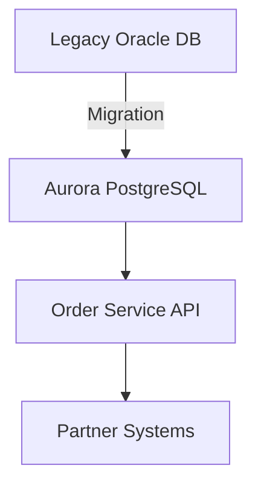

# ADR-001: {{ decision_title }}

**Status:** Proposed  
**Date:** {{ date }}  

## Context
{{ nfrs }}

{{ context }}

## Options
1. **Amazon Aurora PostgreSQL (managed)**
   - ✅ Pros: Managed service, auto-scaling, built-in HA
   - ❌ Cons: Vendor lock-in, cost
   - ⚠️ Risks: Migration complexity, skill gap

2. **Self-managed PostgreSQL on VMs**
   - ✅ Pros: Full control, cheaper infra
   - ❌ Cons: Ops overhead, patching
   - ⚠️ Risks: Reliability, SRE burden

3. **PostgreSQL on Kubernetes**
   - ✅ Pros: Portable, modern
   - ❌ Cons: Complexity, steep learning curve
   - ⚠️ Risks: Cluster reliability, DR gaps

## Trade-off Matrix
| Option                        | {{ d }} | 
|-------------------------------|---------|
| Aurora PostgreSQL (Managed)   | 4/5     |
| Self-managed PostgreSQL (VMs) | 3/5     |
| PostgreSQL on Kubernetes      | 2/5     |

*(Scores: 1 = poor, 5 = excellent)*

## Decision
Choose **Aurora PostgreSQL** because it balances availability, scaling, and reduced ops overhead.  
Team prefers managed service given limited bandwidth.

## Consequences
+ Reduced ops burden  
+ Predictable scaling  
- Vendor lock-in  
- Higher monthly spend  

## Architecture (Mermaid)

## Rollout & Rollback
- Rollout: Dual-write, migrate in phases, cutover at low traffic
- Rollback: Re-point apps to Oracle, replay recent logs

## Fitness Functions
- P95 latency < 250 ms
- Monthly infra cost < $9k
- Backup restore drill passes RTO=2h, RPO=15 min
- Zero data loss during migration

## Review
- Review date: {{ review_date }}
